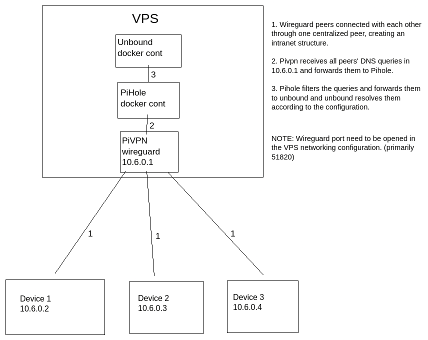

This is a free online VPN setup with added features like network-level adblocking through PiHole and DNS resolving through Unbound.

Received guidance from [here](https://gist.github.com/HarvsG/008700c8d187b072cca335b9a85ad34d#file-docker-compose-yml)

#### Prerequisites

- A Linux VPS with public IP. Also, in this setup VPN location depends on the location of the VPS.
- Docker installed in the VPS.

#### Basic concepts

This is the basic concept of the setup.


## PiVPN setup

Checkout the official sites of [pivpn](https://www.pivpn.io/) and [wireguard](https://www.wireguard.com/)

```
curl -L https://install.pivpn.io | bash
```

Run the command and follow the installation wizard.

Set the DNS Provider as `PiVPN-is-local-DNS` and the IP as `10.6.0.1`

For clients connection, set the `Static IP` as your VPS's public IP, or you have a domain connected to the IP, set the `DNS Entry` as your domain.

Next, if you are using Oracle Cloud free tier VPS,
follow the instruction from [here](https://gist.github.com/HarvsG/008700c8d187b072cca335b9a85ad34d#ssh-into-the-device).

#### Adding configuration in clients

To generate client configuration run the following command and follow,

```
pivpn -a
```

To connect from client devices, download the wireguard clients app from [here](https://www.wireguard.com/install/).

Generate the QR code by running,

```
pivpn -qr
```

Scan the QR to add the configuration to clients

OR, in Linux devices, copy the conf file to `/etc/wireguard/` and run the commands to toggle the connection,

```
sudo wg-quick up <conf_file_name>
```

```
sudo wg-quick down <conf_file_name>
```

## Unbound setup

First, create a docker network,

```
docker network create --subnet=172.18.0.0/16 --gateway=172.18.0.1 pi-net
```

Then, run the unbound docker container script file at `/unbound/unbound_run.sh`

```
sh ./unbound/unbound_run.sh
```

Run the following command to test the unbound setup,

```
dig pnath.in @127.0.0.1 -p 5053
```

In the answer, status should be `status: NOERROR`

##### (Optional)

You can put your own value in the subnet and gateway options.

If you change the subnet and gateway IP, change the ip value inside the `/unbound/unbound_run.sh` file,

```
--ip=172.18.0.2  # Make sure the to put a IP under the specified subnet
```

And add, or change this parameters inside the `/unbound/unbound.conf` file with the new values,

```
access-control: 172.18.0.0/16 allow
```

```
private-address: 172.18.0.0/16
```

## Pi-hole setup

Set your web interface password by uncommenting the `WEBPASSWORD` environment variable

```
# WEBPASSWORD: 'set a secure password here or it will be random'
```

Then, run the docker compose file from the directory

```
docker-compose up -d
```

Now pi-hole will receive the incoming DNS queries from `10.6.0.1`

Pi-hole admin dashboard will be available at `http://10.6.0.1:8082/admin` in the wireguard connected devices.
